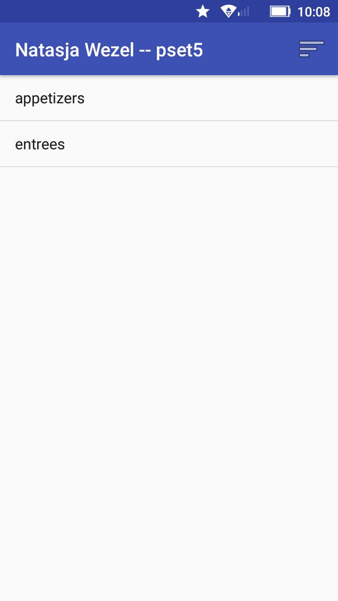
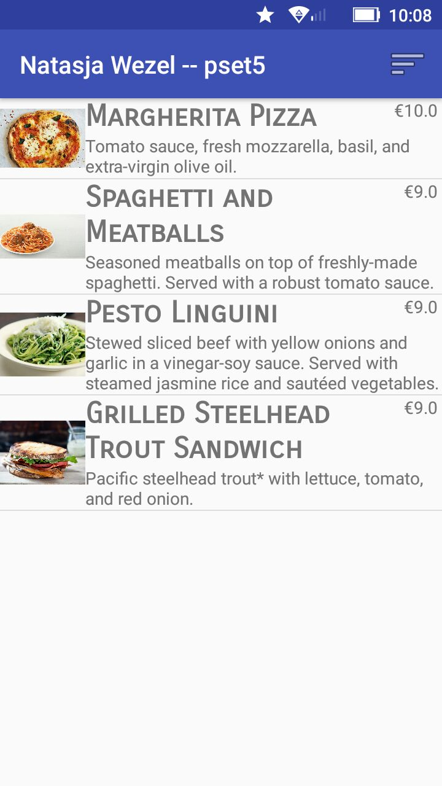
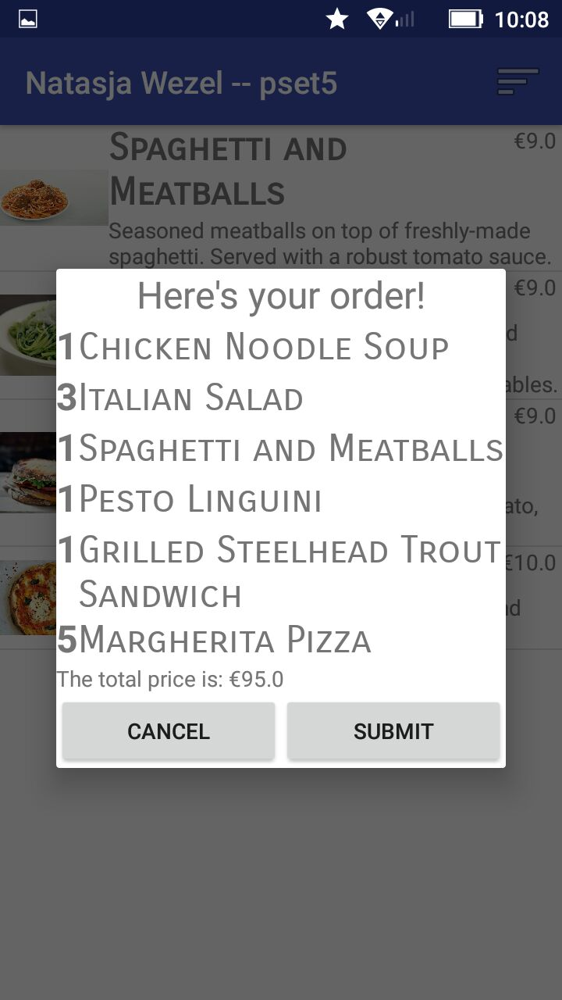
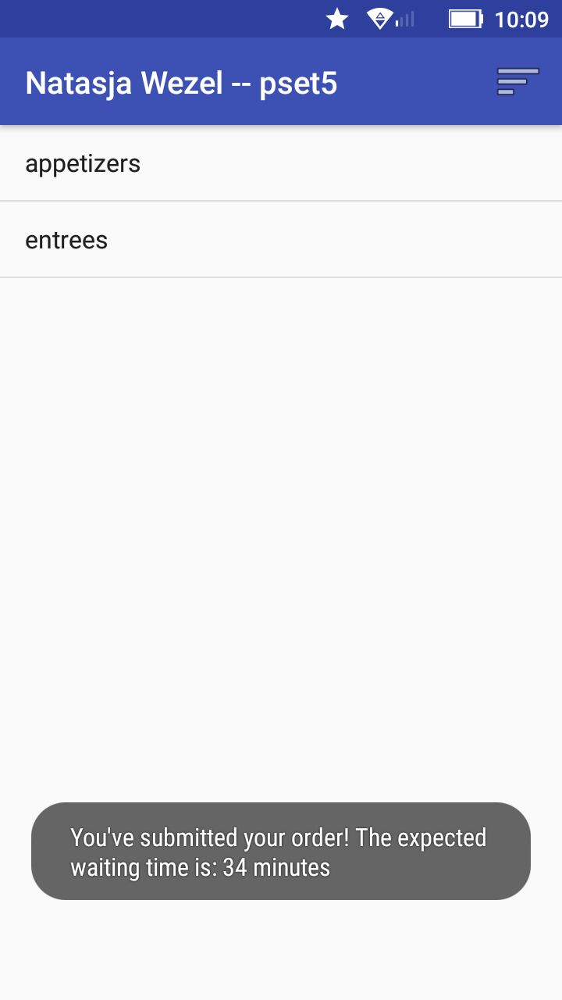

# NatasjaWezelpset5

This app allows the user to navigate through a restaurant's menu and add things to their order. After making an order, you can submit it and get the estimated waiting time.

Below are some screenshot's of the app on my phone (a Lenovo C2)

## The homescreen

## The menu of this restaurant

## The things you've ordered

## When you submit your order

